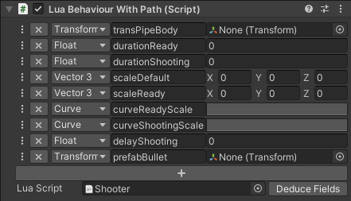
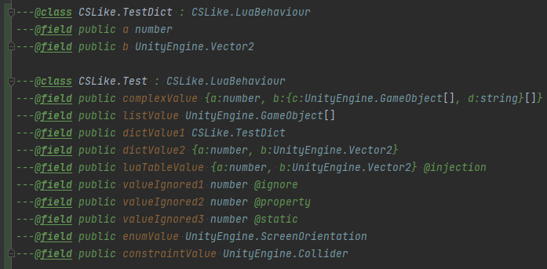
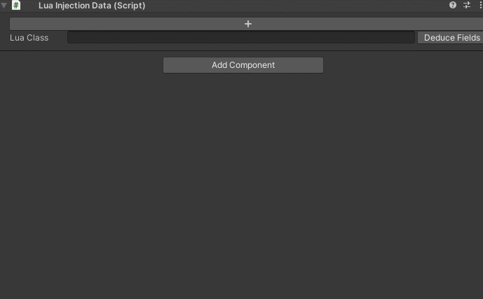
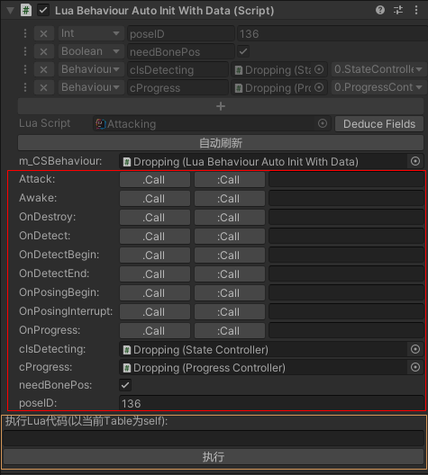
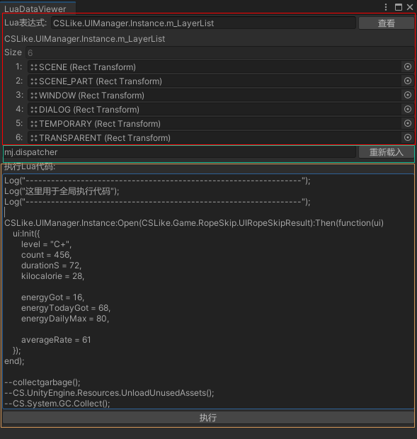

## Unity环境下尽可能将Lua脚本当C#脚本使用

整个框架的目的就是把Lua脚本当C#脚本使用，包括但不限于将Lua脚本挂到GameObject上、Lua的面向对象、将C#的命名规范用在Lua上等等。
本框架在Unity2021.3.29版本上开发，在Unity2019.4.37版本上测试通过，如果需要运行在其他版本上，请尽量自行解决可能出现的版本兼容问题。

## 依赖的框架或插件

* **Xlua：** 本框架是基于Xlua开发的。
* **EmmyLua：**
  * 本框架的Lua部分，是通过Rider+EmmyLua插件写的（VSCode也有，去对应的插件市场安装即可），EmmyLua用于代码提示与补全，不需要该功能可以不装EmmyLua插件。
  * 本框架的成员变量结构生成是基于 [EmmyLua的注解语法](https://emmylua.github.io/annotation.html) 的，请稍微浏览一下该文档。
* **DOTween：** 框架本身并没有用到DOTween，不过示例中用到了，这里的DOTween只是用来学习交流，如果需要在今后的开发中用到DOTween，请购买正版。

## 框架大致功能

框架所有内容都在 [Assets/Tools/LuaBehaviour/Scripts](Assets/Tools/LuaBehaviour/Scripts) 目录下

* **Lua的面向对象的封装、Property（get/set）的封装、Lua枚举的封装。**
* **LuaBehaviour相关功能：** 包括Lua环境的初始化与释放、Unity各生命周期函数的调用、成员变量注入、Inspector面板绘制、成员变量结构生成等。
* **配合LuaBehaviour使用，用于储存数据的容器：** LuaInjectionData、LuaScriptableData。
* **查看Lua表达式的值、重新载入某个脚本、执行任意Lua代码的小工具：** LuaDataViewer。

## 示例大致功能

示例所有内容都在 [Assets/Tools/LuaBehaviour/Demo](Assets/Tools/LuaBehaviour/Demo) 目录下。 详见 [示例提供的内容](#示例提供的内容)  

* 展示LuaBehaviour在UI方面的一种用法，包含一套简单的UI管理框架。
* 展示LuaBehaviour在3D方面的一种用法。
* 一些示例需要用到的封装，如一些扩展、AsyncTask、CoroutineManager、EventManager等。
* CSharpCallLua/LuaCallCSharp的配置，以及将其涉及到的程序集按 [EmmyLua的注解语法](https://emmylua.github.io/annotation.html) 导出成注解的工具。

## 目录结构

本工程内容可大致分为XLua、本框架、示例、DOTween插件四个部分。

* **Assets/Plugins和Assets/XLua：** XLua的内容，没有做任何修改。
* **Assets/Tools/LuaBehaviour/Scripts：** 本框架内容
* **Assets/Tools/LuaBehaviour/Demo：** 示例内容
* **Assets/Demigiant：** DOTween插件，没有做任何修改。

## 导入方法

在原工程中配置好XLua的环境，将 [Assets/Tools/LuaBehaviour/Scripts](Assets/Tools/LuaBehaviour/Scripts) 整个文件夹拷贝到工程中即可。

## 使用方法

1. 将框架中的LuaMain进行自定义改造，以符合项目需要。（参考 [Assets/Tools/LuaBehaviour/Demo/Scripts/LuaMain.cs](Assets/Tools/LuaBehaviour/Demo/Scripts/LuaMain.cs) ）
2. 示例中两个场景分别展示了LuaMain的两种用法：
   * 在“UI”场景中，LuaMain被挂在了场景里的某个GameObject上，然后配置了作为入口的Lua脚本路径，推荐用此方法进行项目Lua环境的正式启动方式。
   * 在“3D”场景中，LuaMain没有挂在任何GameObject上，靠LuaBehaviour调用LuaMain单例来启动Lua环境，比较适合测试场景。
3. 打开ProjectSettings窗口，找到LuaBehaviour标签，设置Lua脚本的根目录和扩展名。（这里的设置只用于编辑器环境Lua脚本的拖放，运行环境的加载请用LuaEnv.AddLoader自己写逻辑。）
   
4. 类似C#那样写Lua脚本，参考示例里的Lua脚本，继承Lua里的LuaBehaviour类。
5. 在目标GameObject上挂上C#脚本LuaBehaviourWithPath。
     
   如果看到了上面图片中的“LuaSrcPathSetting”按钮，说明第3步没有做，那么左边的文本框内需要自己填入require的路径，但不影响运行。  
     
   如果设置Lua脚本的根目录，那么左边的文本框会变成上面图片中的对象拖放框。  
     
   拖入某个Lua脚本后，右边会出现一个按钮，用于自动生成成员变量的结构。当然，也可以点击上面的“+”按钮手动添加成员变量。  
     
   生成出来的结构需要手动填入数据或拖入对象。  
6. 填入数据或拖入对象。运行时，这些数据会在Lua脚本的Awake函数执行之前，成为Lua类实例的成员变量。
7. 如果想要在运行时动态给某个GameObject挂上LuaBehaviour，则可以挂上一个C#脚本LuaBehaviourDynamicAdd，然后传入一个Lua类Table。（参考 [Assets/Tools/LuaBehaviour/Demo/Resources/Lua/Utils/BehaviourUtility.lua](Assets/Tools/LuaBehaviour/Demo/Resources/Lua/Utils/BehaviourUtility.lua) ）

## 注入数据

* 除了LuaBehaviour，还有LuaInjectionData和LuaScriptableData也是带数据的，后两者是单纯的只储存数据，使用方式有两种：
  * 把LuaInjectionData或LuaScriptableData作为一个C#对象进行引用，然后通过调用实例.Data获取到table。
  * 在LuaBehaviour的变量结构中新增一个类型为“Lua Table”的变量，那么LuaInjectionData或LuaScriptableData的数据将会以table的形式储存在LuaBehaviour的成员变量中。
* LuaInjectionData和LuaScriptableData没有拖放Lua脚本的地方，如果需要自动生成变量的结构，可以填入Lua类的类名。
* 注入数据每一行大致可分为操作按钮、类型、变量名、数据、类型约束5个部分。为了更清晰地展示，当Inspector界面宽度较窄时，会选择性地隐藏一部分内容。
    
  * 操作按钮：  
    * “X”按钮显然就是删除当前变量，如果当前变量是列表或字典，则会删除整个列表或字典。  
    * “⋮”按钮右键可以弹出菜单，左键可以拖放。  
        
  * 类型：  
    * “Space”用于分隔变量，无任何意义。  
    * “Int”用于填入整型或枚举。  
      * 当类型约束为某个C#枚举的名称时，数据会显示成枚举下拉框。由于涉及热更问题，可以在C#和Lua分别声明相同名称的枚举，C#的枚举用于Inspector显示，Lua的枚举用于实际运行。
      * 当没有类型约束或者类型约束找不到对应名称的枚举时，数据会显示成整型输入框。由于Lua语言不区分整数和小数，需要在工程内任意位置写一行:
        ```lua
        ---@alias int number
        ```
        然后以“int”声明成员变量，以自动生成“Int”类型的变量结构。
    * “Lua Table”用于拖放LuaInjectionData、LuaScriptableData和另一个LuaBehaviour，自动转化为LuaTable。  
    * “List”和“Dict”用于注入复杂数据，也会自动转化为LuaTable。  
      
  * 变量名：“List”中的变量名不可用，显示成序号。
  * 数据：不同的类型会显示不同的数据，如果类型是Component的派生类，则还会显示下拉框用于选择挂在同一GameObject上的不同组件实例。如果类型是Int，则会根据类型约束确定是否显示成枚举下拉框。
  * 类型约束：用于更细致地约束数据类型。
    * 用于将“Int”类型显示成枚举。
    * 当类型为“Object”、“Behaviour”或“Other Comp”时，可以精确指定拖入对象的类型，也可以约束为多个派生类的基类。
* 由于Unity序列化的限制，被序列化的结构不能嵌套自身，所以每一层做成了不同的类型，最多支持8层。

## 自动生成变量结构

这里的结构是根据Lua脚本里的注释生成的，使用的是 [EmmyLua的注解语法](https://emmylua.github.io/annotation.html)。  
另外我自定义了一些规则:
* @ignore、@property和@static可以阻止生成结构。
* @injection可以生成“Lua Table”类型的结构。
  
  

## Inspector上的其他内容

LuaBehaviour的Inspector面板在运行时还提供了查看Lua实例数据和临时执行Lua代码功能。
* 红色区域展示了Lua实例内部的数据，其中LuaFunction会带有两个按钮，一个是静态调用，一个是实例调用，后面跟着的是参数输入框，可以直接以写Lua代码的形式将多个参数传入，如“1, "str", true”。
* 黄色区域提供了一个写Lua代码的输入框，可以以当前Lua实例作为self执行Lua代码。


## 框架提供了一个简陋的小工具

从Window/LuaDataViewer菜单项可以打开一个工具窗口。
* 红色区域可以根据表达式展示Lua执行结果。
* 绿色区域用来重新require一个Lua脚本。
* 黄色区域用来全局执行临时的Lua代码。
  

## 示例提供的内容

* **如何初始化Lua环境并调用Lua入口函数：** 参考 [Demo里的UI场景](Assets/LuaBehaviour/Demo/Scenes/UI.scene) 和 [Demo里的LuaMain脚本](Assets/Tools/LuaBehaviour/Demo/Scripts/LuaMain.cs)。
* **如何在测试场景中随意使用LuaBehaviour(自动初始化Lua环境但不调用Lua入口函数)：** 直接使用即可，参考 [Demo里的3D场景](Assets/LuaBehaviour/Demo/Scenes/3D.scene)。
* **如何使用EmmyLua进行Lua代码的提示：**
  1. VSCode或者IDEA或者Rider里在插件市场搜索EmmyLua并安装
  2. 根据自己自己的IDE，Unity编辑器里分别点击“Xlua/EmmyLua/DllToLuaLib”和“Xlua/EmmyLua/GenerateNameSpaceMap”下的对应菜单项，等待生成完成后引入项目。具体细节请看 [DllToLuaLib使用说明](Assets/Tools/LuaBehaviour/Demo/Editor/ForEmmyLua/使用说明.txt)。
  3. 有什么疑问可以在QQ上搜EmmyLua群，去QQ群里问，插件相关的问题我也不太懂。
* **XLua的LuaCallCSharp和CSharpCallLua是否需要修改：** 不需要修改，示例中有一份 [配置](Assets/LuaBehaviour/Demo/Editor/XLuaGenConfig.cs)，是在XLua的ExampleConfig.cs的基础上根据经验添加了一点东西，可以作为参考
* **示例还提供了一些基础的封装：**
  * **GlobalExtension:** pairs和ipairs支持遍历C#对象，log内容附上堆栈信息等。
  * **BehaviourUtility:** 单例封装，用于外部监听Unity脚本生命周期函数的匿名LuaBehaviour类。
  * **AsyncTask:** 方便执行异步任务的封装，有点像JavaScript的Promise。
  * **EventManager:** 事件分发管理器。
  * **CoroutineManager:** 协程管理器。
  * **UIManager:** 简单手游的UI管理框架。